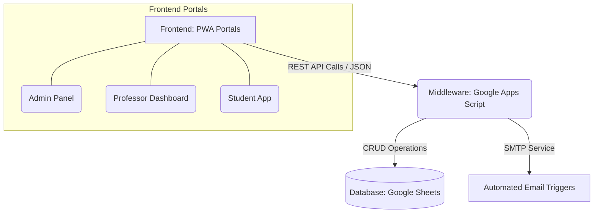

# SmartAttend - Project Architecture & Technical Specifications

## 1. Executive Summary
SmartAttend is a modern, end-to-end automated attendance and classroom management ecosystem. It eliminates the manual, error-prone processes of traditional roll calls by leveraging facial recognition, secure live-session codes, and automated communication. The platform is built as a serverless architecture, ensuring zero hosting costs for the backend while maintaining high availability and real-time synchronization.

---

## 2. High-Level System Architecture

The system operates on a lightweight, highly scalable 3-tier architecture:

### A. Frontend (Client-Side)
*   **Technologies**: HTML5, Vanilla CSS3 (Custom Glassmorphism UI), Vanilla JavaScript.
*   **Deployment**: Hosted globally on Netlify (`https://extraordinary-baklava-246d96.netlify.app`).
*   **PWA Integration**: Includes a configured `manifest.json` and a Service Worker (`sw.js`). This allows the web portals to be installed directly onto iOS/Android home screens as native-like mobile applications with caching capabilities.

### B. Middleware / API Layer (Server-Side)
*   **Technologies**: Google Apps Script (GAS).
*   **Functionality**: Acts as a serverless REST API (`doGet` / `doPost`). It handles CORS policies, parses incoming JSON requests from the frontend, executes complex logic (like fuzzy string matching), and securely interfaces with the database.

### C. Database (Storage Layer)
*   **Technologies**: Google Sheets.
*   **Structure**: Highly structured relational tabs (Admin Settings, Professor Profiles, Master Student Database, AttendanceHistory, Timetable metadata). Google Sheets provides a familiar, instantly accessible GUI for administrators to manually audit raw data.

---

## 3. Core Modules & Engineering Logic

### 3.1. Dual-Mode Attendance System
1. **Face Scan (Automated)**: Utilizes a camera feed to recognize students. The system cross-references the live scan with registered profiles and immediately logs the timestamp.
2. **Live Lab Attendance (Self-Service)**: For computer labs where face scanning isn't viable. The professor generates a 6-digit cryptographic access code on a 5-minute timer. Students input this code on their own devices to mark themselves present.
   *   **Anti-Proxy Device Fingerprinting**: To prevent a student from marking their absent friends present, the frontend captures browser properties (User Agent, Screen Dimensions, Color Depth, Language). The backend rejects multiple submissions originating from the exact same hardware fingerprint within a single session.

### 3.2. Automated Communication Engine
*   The backend features a robust HTML email generation engine.
*   **Student Alerts**: Sends customized amber-themed warnings detailing exact late minutes or absences.
*   **Parent Alerts**: Simultaneously extracts the `Parent_Email` from the database and sends a formal, professional notification to guardians regarding student truancy.
*   **Analytics Delivery**: Professors can generate weekly, monthly, or yearly attendance reports across entire departments. The backend instantly compiles this data into a color-coded HTML table and emails it directly to the professor.

### 3.3. Advanced Data Synchronization
*   **Fuzzy String Matching**: Resolves data-entry discrepancies. If an admin uploads a timetable mapped to the course code "BCA", and a student logs in under "Bachelor of computer application", the custom `isDeptMatch` algorithm seamlessly recognizes the relationship and serves the correct files.
*   **Data Sanitization**: Semester inputs are aggressively parsed (using RegEx `/[^0-9]/g`) to extract the numeric root, ensuring "2nd sem", "Semester 2", and "2" are all treated identically by the database.

---

## 4. Security & Validation Checkpoints

1. **Weekend Guard Protocol**: Frontend and backend validators explicitly block the creation of live attendance sessions on Saturdays and Sundays, preventing accidental data corruption on non-working days.
2. **Forward-Only Calendars**: HTML5 date pickers are dynamically injected with `min=today`, physically disabling the UI from allowing professors to retroactively alter or generate past sessions.
3. **Secure Document Delivery**: Timetables and medical leave documents are hosted securely on Google Drive, with the backend passing direct-download and preview URLs exclusively to authorized student and professor panels.

---

## 5. Conclusion
SmartAttend is not just a digital register; it is a meticulously engineered educational tool. By delegating the heavy computational lifting to the client devices and utilizing Google's serverless infrastructure for data routing, the platform achieves enterprise-level utility, robust security, and a premium user experience without incurring any operational hosting costs.
