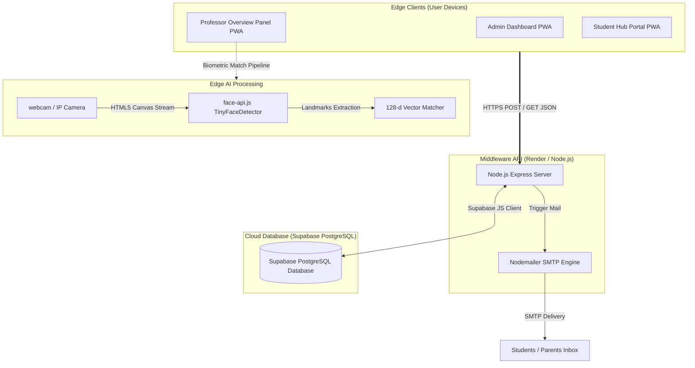
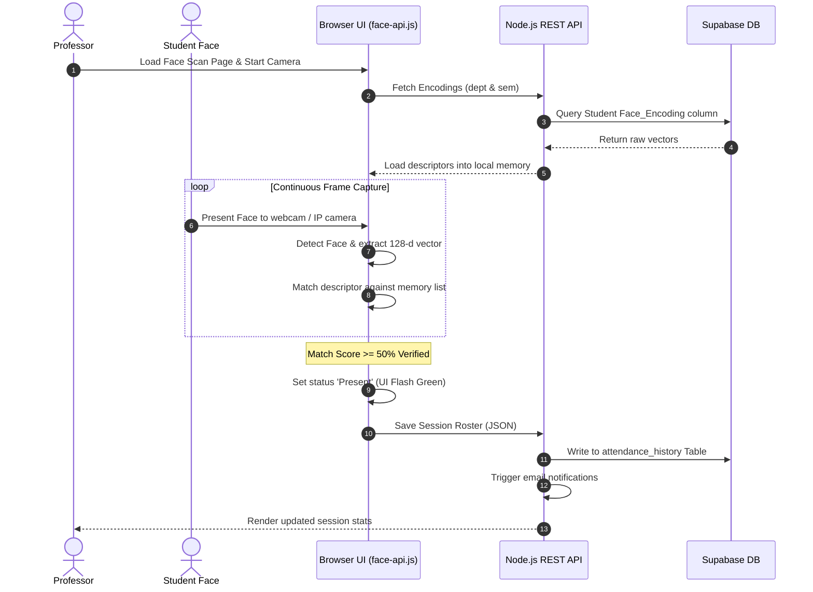
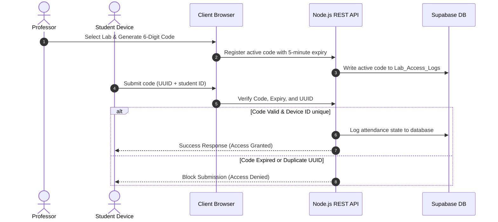

# 🎓 SmartAttend — AI-Powered Attendance & Academic Management Platform

An enterprise-grade Educational ERP system integrating client-side biometric facial recognition, device fingerprinting, real-time analytics, and automated multi-channel notifications.

---

## 📋 Table of Contents
1. [Professional Overview](#1-professional-overview)
2. [Problem Statement](#2-problem-statement)
3. [Why SmartAttend Exists](#3-why-smartattend-exists)
4. [Key Features](#4-key-features)
5. [System Architecture](#5-system-architecture)
6. [User Roles & Access Control](#6-user-roles--access-control)
7. [Attendance Workflows](#7-attendance-workflows)
8. [Technology Stack](#8-technology-stack)
9. [Security Infrastructure](#9-security-infrastructure)
10. [Edge AI & Facial Recognition](#10-edge-ai--facial-recognition)
11. [System Interface Screenshots](#11-system-interface-screenshots)
12. [Project Structure](#12-project-structure)
13. [Installation & Configuration Guide](#13-installation--configuration-guide)
14. [Deployment Strategy](#14-deployment-strategy)
15. [Performance & Scalability Analysis](#15-performance--scalability-analysis)
16. [Research Contributions](#16-research-contributions)
17. [Project Statistics](#17-project-statistics)
18. [Future Roadmap](#18-future-roadmap)
19. [Learning Outcomes](#19-learning-outcomes)
20. [License](#20-license)
21. [Author & Contributors](#21-author--contributors)

---

## 1. Professional Overview

SmartAttend is a modern Educational ERP platform designed to modernize attendance tracking and academic management in higher education. Operating on a decentralized architecture, the platform handles real-time face matching on edge devices (user browsers) via computer vision, bypassing the need for expensive, centralized AI server infrastructures. 

All verified transactional states are synchronized with a secure Supabase (PostgreSQL) backend through a RESTful API layer running on Node.js (hosted on Render), executing automated email notifications to students and parents dynamically.

---

## 2. Problem Statement

Traditional educational administration suffers from systemic operational inefficiencies:
*   **Manual Roster Verification**: Consumes 10–15% of active lecture time, reducing instructional efficiency.
*   **Biometric Proxying (Buddy Punching)**: Standard roll-calls and barcode-based check-ins are easily forged by peers.
*   **Communication Gaps**: Delayed parent notifications regarding student absences hinder early intervention.
*   **Data Fragmentation**: Timetables, leave requests, and assignment portals exist in disconnected administrative silos.
*   **High Infrastructure Cost**: Deploying deep learning recognition models at scale usually requires dedicated server GPUs and complex REST APIs.

---

## 3. Why SmartAttend Exists

SmartAttend replaces administrative overhead with an integrated, zero-trust Educational ERP. It operates under two primary paradigms:
1.  **Scalable Cloud Processing**: Bypassing traditional heavy infrastructure costs by using Supabase as a scalable relational database and a Node.js Express server on Render for the API.
2.  **Edge-AI Processing**: Utilizing client-side hardware to execute face detection and 128-dimensional vector matching, ensuring user data privacy and infinite horizontal scalability.

---

## 4. Key Features

| Feature Area | Technical Description | Business/Educational Value |
| :--- | :--- | :--- |
| **Edge Face Scanning** | Client-side computer vision landmarks extraction and matching using `face-api.js`. | High-accuracy biometric tracking with zero server hosting costs. |
| **Lab Access Codes** | Generated 6-digit session codes with 5-minute decay windows. | Enables secure self-service attendance logging for computer labs. |
| **Late Monitoring** | Automated late-time accumulation tracking (in minutes) logged per student. | Enables detailed tracking of academic tardiness metrics. |
| **Leave Management** | Cloud-synced workflow allowing students to upload medical/leave proofs. | Replaces paper trails with structured approval workflows. |
| **Timetable Sync** | Fuzzy matching maps room numbers and schedule tables to current users. | Organizes administrative tasks by student/professor schedule. |
| **Assignment Hub** | Broadcast uploader supporting attachments and dynamic subject targets. | Simplifies distribution of academic materials and assignments. |

---

## 5. System Architecture



---

## 6. User Roles & Access Control

| Role | Database Authentication | Dashboard Access | Allowed CRUD Actions |
| :--- | :--- | :--- | :--- |
| **Administrator** | Secure admin login credentials | Admin Panel UI | Create/Update/Delete Students, Professors, Departments, Classrooms, Subjects, Timetables, and Classroom Camera IPs. |
| **Professor** | Verified registration email OTP | Professor Overview Panel | Initiate Face Scan, Generate Lab Access Codes, Log Late Minutes, Approve/Reject Leaves, Upload Assignments, and Trigger Analytics Reports. |
| **Student** | Verified email OTP & permanent password | Student Hub Portal | View Personal Attendance, Submit Leaves (with attachments), Download Assignments, and View Class Timetables. |

---

## 7. Attendance Workflows

### Biometric Face Scan Workflow


### Lab Access Code Workflow


---

## 8. Technology Stack

| Layer | Technology | Version / Specification | Role in System |
| :--- | :--- | :--- | :--- |
| **UI Rendering** | HTML5, CSS3, Vanilla JS | ES6 Syntax, Outfit Google Fonts | Presentation layer with Glassmorphism styles. |
| **Web Runtime** | jQuery | v3.7.1 | Dynamic DOM updates and asynchronous AJAX calls. |
| **Edge AI** | `face-api.js` | v0.22.2 (TinyFaceDetector) | Face detection, landmark tracking, vector generation. |
| **API Middleware** | Node.js / Express | Node 18+ | REST API executing database CRUD operations and JWT Auth. |
| **Database** | Supabase | PostgreSQL | Scalable cloud database for user credentials, encodings, and logs. |
| **Notifications** | Nodemailer | SMTP | Automated OTP delivery and parent alert notifications. |
| **Distribution** | PWA Manifest & Service Worker | Standard Web API | Transforms web portals into installable offline PWAs. |

---

## 9. Security Infrastructure

SmartAttend implements a zero-trust, multi-layered security framework:
*   **Cryptographic Access Verification (OTP) & JWT**: Bypasses hardcoded passwords during activation. Users must submit a secure 6-digit OTP delivered via email. Once verified, a secure JSON Web Token (JWT) is issued for all subsequent API requests.
*   **Anti-Proxy Device Locking**: When logging attendance via lab access codes, the browser generates a random, permanent `DeviceID` UUID stored in the client’s local storage. The backend rejects any submissions containing a duplicate `DeviceID` for the same session.
*   **Hardware Fingerprint Isolation**: Mitigates browser variations by using local storage UUID verification, eliminating false positives for identical phone models.
*   **Date Restriction Checkpoints**: Replaces UTC-based date strings with local date strings (`toLocaleDateString('en-CA')` in YYYY-MM-DD format) synchronized to India Standard Time (IST - GMT+5:30) at the backend, blocking weekend entries and retrospective updates.

---

## 10. Edge AI & Facial Recognition

SmartAttend implements decentralized face analysis using weights loaded dynamically via CDN:

```javascript
// Landmark and vector generation pipeline
const detections = await faceapi
  .detectAllFaces(cameraImg, new faceapi.TinyFaceDetectorOptions({ inputSize: 128, scoreThreshold: 0.6 }))
  .withFaceLandmarks()
  .withFaceDescriptors();
```

*   **Model Specifications**: Utilizes `TinyFaceDetector` for real-time mobile/desktop browser processing (optimized at 128px input resolution to balance CPU usage and accuracy).
*   **Biometric Matching**: The browser matches the face descriptor vector (128-dimensional array of floats) against local descriptors loaded on setup. Recognition is verified under a strict Euclidean distance threshold of `0.5` (50%+ similarity score).
*   **Storage Normalization**: Matches are compiled to standard JSON arrays and saved directly to the database:
    ```json
    [-0.09824, 0.12453, 0.05672, ... 128 float values]
    ```

---

## 11. System Interface Screenshots

> [!NOTE]
> *This section contains placeholders. Replace these paths with actual screenshots of your system.*

### 1. Professor Portal Dashboard

*(Place a screenshot here showing the main dashboard page, active scan button, and live attendance metrics panel)*

### 2. Biometric Facial Registration Portal

*(Place a screenshot here showing the registration camera view, department/semester dropdown filters, and the webcam face-box overlay)*

### 3. Student Hub & Leave Request Panel

*(Place a screenshot here showing the student attendance percentage, leaf request submit form, and timetable cards)*

### 4. Admin Panel & Academic Registry

*(Place a screenshot here showing the admin dashboard, student list edit table, and Camera IP classroom setup panel)*

---

## 12. Project Structure

The project codebase follows a modular design pattern:
```text
SmartAttend/
├── server/                        # Node.js Backend API
│   ├── server.js                  # Main Express Server & Supabase Integration
│   └── package.json               # Backend dependencies (express, cors, supabase-js)
├── backend/                       # Frontend JS Controller Scripts (AJAX/Fetch logic)
│   ├── config.js                  # Central configuration (SCRIPT_URL)
│   ├── admin_dashboard.js         # Admin panel CRUD and modal controllers
│   ├── register.js                # Biometric registration, filters, and webcam stream
│   ├── start_attendance.js        # Face scan video loop and live matching
│   ├── student_dashboard.js       # Student views, UUID storage, and leave requests
│   └── login.js / forget.js       # Authentication handlers and OTP logic
├── html/                          # Portal HTML5 Files
│   ├── admin_dashboard.html       # Administrative Panel
│   ├── dashboard1.html            # Professor overview portal
│   ├── Start Attendance.html      # Biometric scan camera module
│   ├── student_dashboard.html     # Student Hub
│   └── register.html              # Face Registration Portal
├── python files/                  # Local Biometric Validation Utilities
│   ├── generate_encoding.py       # Computes average vectors from directory images
│   └── test_live_webcam.py        # Local Python webcam biometric tracker
└── manifest.json / sw.js          # Progressive Web App configuration files
```

---

## 13. Installation & Configuration Guide

### System Prerequisites
*   A Supabase Account (for PostgreSQL Database).
*   A Render Account (for hosting the Node.js backend).
*   A Netlify Account (for hosting the frontend).

### 1. Database Configuration (Supabase)
1. Create a new Supabase project.
2. Run the provided SQL setup scripts (or use the Supabase dashboard) to create your tables: `student`, `professor`, `departments`, `attendancehistory`, and `lab_access_logs`.
3. Go to **Project Settings > API** and copy your `Project URL` and `service_role secret`.

### 2. Node.js Backend Setup (Render)
1. Push the `server/` directory code to a GitHub repository.
2. In Render, create a new **Web Service** and connect your GitHub repository.
3. Set the Build Command to `npm install` and the Start Command to `node server.js`.
4. Add your Environment Variables (`.env`) in the Render dashboard:
    *   `SUPABASE_URL` = Your Supabase Project URL
    *   `SUPABASE_SERVICE_ROLE_KEY` = Your Supabase Service Role Key
    *   `JWT_SECRET` = A random secret string
    *   `SMTP_USER` / `SMTP_PASS` = Your email credentials for OTPs
5. Deploy the web service and copy the generated Render URL (e.g., `https://smartattend-api.onrender.com`).

### 3. Frontend Config & Netlify Deployment
1.  Open `backend/config.js` in your local code workspace.
2.  Set the `SCRIPT_URL` property to your copied Render Web App URL:
    ```javascript
    window.SMART_ATTEND_CONFIG = {
        SCRIPT_URL: "https://smartattend-api.onrender.com"
    };
    ```
3. Drag and drop your root folder (excluding the `server/` directory) into Netlify for static frontend hosting.

---

## 14. Deployment Strategy

The application is deployed across three scalable platforms:
1. **GitHub**: Stores the central repository and triggers automatic deployments.
2. **Render**: Hosts the Node.js Express backend API, scaling resources as needed.
3. **Netlify**: Globally caches and serves the frontend HTML/JS/CSS files, providing lightning-fast load times.
4. **Oracle Cloud (Future Scale)**: If user limits exceed Render's affordable tiers, the Dockerized Node.js backend will be seamlessly migrated to an Oracle Cloud Always Free ARM instance to support 10,000+ concurrent connections.

---

## 15. Performance & Scalability Analysis

SmartAttend is engineered to run on a decoupled architecture, separating the API layer from the frontend delivery:

### Concurrency Handling
By migrating from Google Sheets to Supabase (PostgreSQL) and Node.js, the system can handle thousands of concurrent read/write operations per second. 
*   **Edge Matching**: Heavy biometric computing is shifted to client browsers, meaning the server only processes lightweight JSON payloads (approx. 50ms per request).
*   **Connection Pooling**: Node.js efficiently handles asynchronous database writes, preventing the server from locking up during a 9:00 AM attendance rush.

---

## 16. Research Contributions

SmartAttend serves as a model for modern SaaS paradigms:
*   **"Vibe Coding" Development Paradigm**: Evaluates human-AI collaborative systems, where a human developer acts as the system architect while generative AI models write boilerplate files.
*   **Edge Computing & Data Privacy**: Landmark vector matching runs locally on client devices, meaning biometric data is parsed and evaluated without sending raw user images to cloud servers.

---

## 17. Project Statistics

*   **Total Lines of Code**: ~22,000 LOC (across HTML, CSS, JavaScript, Python, and Node.js).
*   **Biometric Models Loading Time**: <1.5 seconds on standard desktop/mobile processors.
*   **Euclidean Threshold Limit**: 0.5 (strictly calibrated to minimize false-positive matching under poor lighting).
*   **Database Scaling Limit**: 50,000+ active users (Supabase PostgreSQL limits).

---

## 18. Future Roadmap

- [DONE - 28-06-2026 ] **Database Migration (Supabase Integration)**: Move from Google Sheets to a PostgreSQL DB hosted on Supabase to support WebSockets and resolve concurrency issues.
- [ ] **Capacitor Android/iOS Wrappers**: Compile the frontend portal into standalone Android APK and iOS APP bundles using Capacitor CLI.
- [ ] **Auto-Generated Leave Verification**: Integrate Gemini AI to parse uploaded leave/medical images and automatically check dates, signatures, and stamps.
- [ ] **Multi-Tenant SaaS Panel**: Build a tenant panel allowing multiple departments to operate separate databases under a single system interface.

---

## 19. Learning Outcomes

Developing SmartAttend provided insights into:
*   Real-world implementations of browser-based computer vision and Euclidean space vector comparisons.
*   Migrating from Serverless MVP architectures (Google Apps Script) to Production Cloud stacks (Node.js/Supabase).
*   Designing state-synchronized PWAs using service worker cache systems.
*   Implementing strict anti-proxy tracking heuristics on edge devices.

---

## 20. License

This project is licensed under the MIT License - see the LICENSE file for details.

---

## 21. Author & Contributors

*   **Lead Architect**: aman7474ak@gmail.com
*   *Project created and evaluated for final-year thesis verification.*
