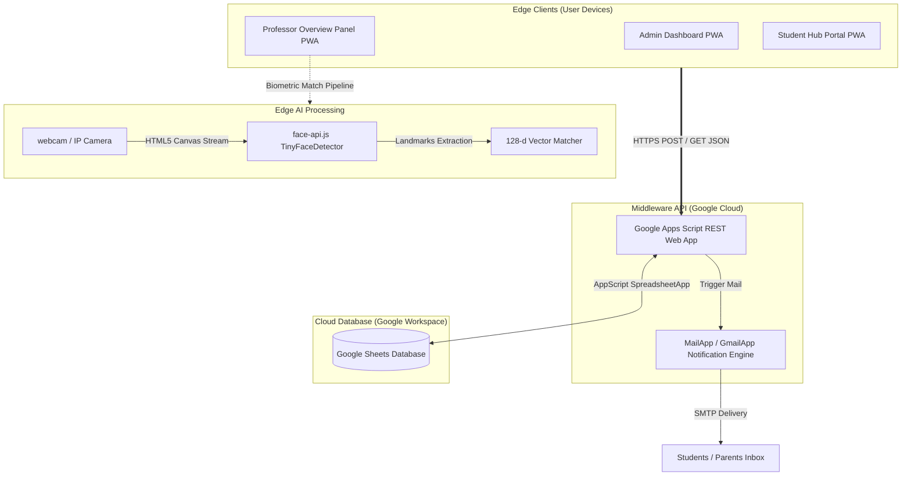
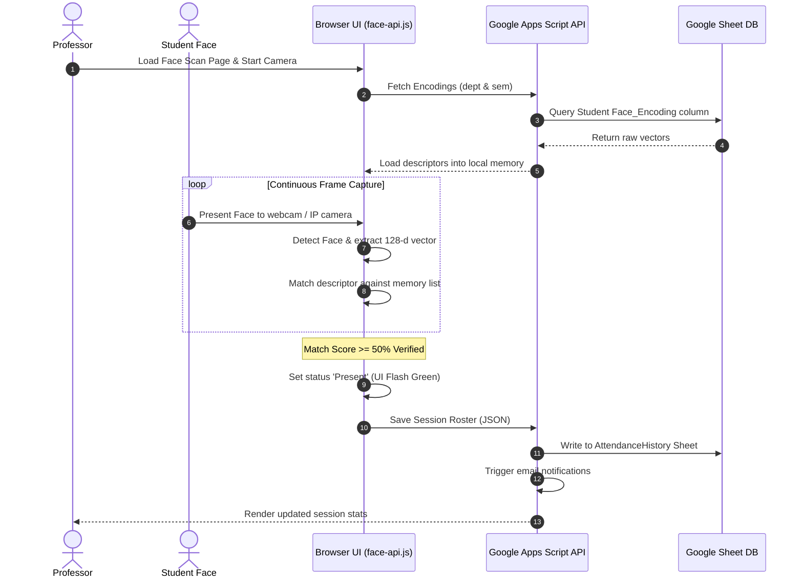
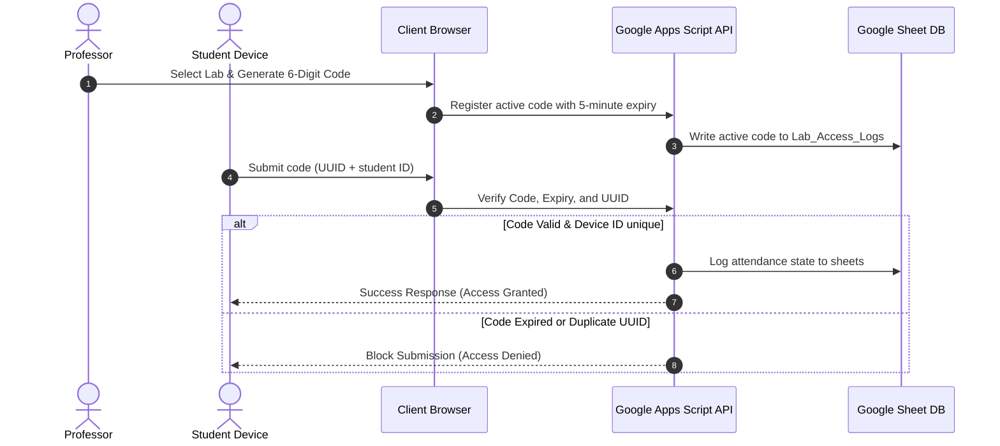

# 🎓 SmartAttend — AI-Powered Attendance & Academic Management Platform

An enterprise-grade, serverless Educational ERP system integrating client-side biometric facial recognition, device fingerprinting, real-time analytics, and automated multi-channel notifications.

---

## 📋 Table of Contents
1. [Professional Overview](#1-professional-overview)
2. [Problem Statement](#2-problem-statement)
3. [Why SmartAttend Exists](#3-why-smartattend-exists)
4. [Key Features](#4-key-features)
5. [System Architecture](#5-system-architecture)
6. [User Roles & Access Control](#6-user-roles--access-control)
7. [Attendance Workflows](#7-attendance-workflows)
8. [Technology Stack](#8-technology-stack)
9. [Security Infrastructure](#9-security-infrastructure)
10. [Edge AI & Facial Recognition](#10-edge-ai--facial-recognition)
11. [System Interface Screenshots](#11-system-interface-screenshots)
12. [Project Structure](#12-project-structure)
13. [Installation & Configuration Guide](#13-installation--configuration-guide)
14. [Deployment Strategy](#14-deployment-strategy)
15. [Performance & Scalability Analysis](#15-performance--scalability-analysis)
16. [Research Contributions](#16-research-contributions)
17. [Project Statistics](#17-project-statistics)
18. [Future Roadmap](#18-future-roadmap)
19. [Learning Outcomes](#19-learning-outcomes)
20. [License](#20-license)
21. [Author & Contributors](#21-author--contributors)

---

## 1. Professional Overview

SmartAttend is a serverless Educational ERP platform designed to modernize attendance tracking and academic management in higher education. Operating on a decentralized architecture, the platform handles real-time face matching on edge devices (user browsers) via computer vision, bypassing the need for expensive, centralized AI server infrastructures. 

All verified transactional states are synchronized with a secure Google Sheets backend through a RESTful API layer running on Google Apps Script, executing automated HTML notifications to students and parents dynamically.

---

## 2. Problem Statement

Traditional educational administration suffers from systemic operational inefficiencies:
*   **Manual Roster Verification**: Consumes 10–15% of active lecture time, reducing instructional efficiency.
*   **Biometric Proxying (Buddy Punching)**: Standard roll-calls and barcode-based check-ins are easily forged by peers.
*   **Communication Gaps**: Delayed parent notifications regarding student absences hinder early intervention.
*   **Data Fragmentation**: Timetables, leave requests, and assignment portals exist in disconnected administrative silos.
*   **High Infrastructure Cost**: Deploying deep learning recognition models at scale usually requires dedicated server GPUs and complex REST APIs.

---

## 3. Why SmartAttend Exists

SmartAttend replaces administrative overhead with an integrated, zero-trust Educational ERP. It operates under two primary paradigms:
1.  **Serverless Processing**: Bypassing server costs by using Google Sheets as a relational database and Google Apps Script as a middleware API.
2.  **Edge-AI Processing**: Utilizing client-side hardware to execute face detection and 128-dimensional vector matching, ensuring user data privacy and infinite horizontal scalability.

---

## 4. Key Features

| Feature Area | Technical Description | Business/Educational Value |
| :--- | :--- | :--- |
| **Edge Face Scanning** | Client-side computer vision landmarks extraction and matching using `face-api.js`. | High-accuracy biometric tracking with zero server hosting costs. |
| **Lab Access Codes** | Generated 6-digit session codes with 5-minute decay windows. | Enables secure self-service attendance logging for computer labs. |
| **Late Monitoring** | Automated late-time accumulation tracking (in minutes) logged per student. | Enables detailed tracking of academic tardiness metrics. |
| **Leave Management** | Cloud-synced workflow allowing students to upload medical/leave proofs. | Replaces paper trails with structured approval workflows. |
| **Timetable Sync** | Fuzzy matching maps room numbers and schedule tables to current users. | Organizes administrative tasks by student/professor schedule. |
| **Assignment Hub** | Broadcast uploader supporting attachments and dynamic subject targets. | Simplifies distribution of academic materials and assignments. |

---

## 5. System Architecture



---

## 6. User Roles & Access Control

| Role | Database Authentication | Dashboard Access | Allowed CRUD Actions |
| :--- | :--- | :--- | :--- |
| **Administrator** | Secure admin login sheet credentials | Admin Panel UI | Create/Update/Delete Students, Professors, Departments, Classrooms, Subjects, Timetables, and Classroom Camera IPs. |
| **Professor** | Verified registration email OTP | Professor Overview Panel | Initiate Face Scan, Generate Lab Access Codes, Log Late Minutes, Approve/Reject Leaves, Upload Assignments, and Trigger Analytics Reports. |
| **Student** | Verified email OTP & permanent password | Student Hub Portal | View Personal Attendance, Submit Leaves (with attachments), Download Assignments, and View Class Timetables. |

---

## 7. Attendance Workflows

### Biometric Face Scan Workflow


### Lab Access Code Workflow


---

## 8. Technology Stack

| Layer | Technology | Version / Specification | Role in System |
| :--- | :--- | :--- | :--- |
| **UI Rendering** | HTML5, CSS3, Vanilla JS | ES6 Syntax, Outfit Google Fonts | Presentation layer with Glassmorphism styles. |
| **Web Runtime** | jQuery | v3.7.1 | Dynamic DOM updates and asynchronous AJAX calls. |
| **Edge AI** | `face-api.js` | v0.22.2 (TinyFaceDetector) | Face detection, landmark tracking, vector generation. |
| **API Middleware** | Google Apps Script | V8 Javascript Engine | Serverless REST API executing database CRUD operations. |
| **Database** | Google Sheets | Google Workspace | Cloud storage for user credentials, encodings, and logs. |
| **Notifications** | MailApp & GmailApp | Native Google Apps Script | Automated OTP delivery and parent alert notifications. |
| **Distribution** | PWA Manifest & Service Worker | Standard Web API | Transforms web portals into installable offline PWAs. |

---

## 9. Security Infrastructure

SmartAttend implements a zero-trust, multi-layered security framework:
*   **Cryptographic Access Verification (OTP)**: Bypasses hardcoded passwords during activation. Users must submit a secure 6-digit OTP delivered via email, verified server-side with a strict **10-minute expiration** timestamp check.
*   **Anti-Proxy Device Locking**: When logging attendance via lab access codes, the browser generates a random, permanent `DeviceID` UUID stored in the client’s local storage. The Apps Script backend rejects any submissions containing a duplicate `DeviceID` for the same session.
*   **Hardware Fingerprint Isolation**: Mitigates browser variations by using local storage UUID verification, eliminating false positives for identical phone models.
*   **Date Restriction Checkpoints**: Replaces UTC-based date strings with local date strings (`toLocaleDateString('en-CA')` in YYYY-MM-DD format) synchronized to India Standard Time (IST - GMT+5:30) at the backend, blocking weekend entries and retrospective updates.

---

## 10. Edge AI & Facial Recognition

SmartAttend implements decentralized face analysis using weights loaded dynamically via CDN:

```javascript
// Landmark and vector generation pipeline
const detections = await faceapi
  .detectAllFaces(cameraImg, new faceapi.TinyFaceDetectorOptions({ inputSize: 128, scoreThreshold: 0.6 }))
  .withFaceLandmarks()
  .withFaceDescriptors();
```

*   **Model Specifications**: Utilizes `TinyFaceDetector` for real-time mobile/desktop browser processing (optimized at 128px input resolution to balance CPU usage and accuracy).
*   **Biometric Matching**: The browser matches the face descriptor vector (128-dimensional array of floats) against local descriptors loaded on setup. Recognition is verified under a strict Euclidean distance threshold of `0.5` (50%+ similarity score).
*   **Storage Normalization**: Matches are compiled to standard JSON arrays and saved directly to the database:
    ```json
    [-0.09824, 0.12453, 0.05672, ... 128 float values]
    ```

---

## 11. System Interface Screenshots

> [!NOTE]
> *This section contains placeholders. Replace these paths with actual screenshots of your system.*

### 1. Professor Portal Dashboard

*(Place a screenshot here showing the main dashboard page, active scan button, and live attendance metrics panel)*

### 2. Biometric Facial Registration Portal

*(Place a screenshot here showing the registration camera view, department/semester dropdown filters, and the webcam face-box overlay)*

### 3. Student Hub & Leave Request Panel

*(Place a screenshot here showing the student attendance percentage, leaf request submit form, and timetable cards)*

### 4. Admin Panel & Academic Registry

*(Place a screenshot here showing the admin dashboard, student list edit table, and Camera IP classroom setup panel)*

---

## 12. Project Structure

The project codebase follows a modular design pattern:
```text
SmartAttend/
├── backend/                       # Core JS Controller Scripts
│   ├── config.js                  # Central configuration (SCRIPT_URL)
│   ├── admin_dashboard.js         # Admin panel CRUD and modal controllers
│   ├── register.js                # Biometric registration, filters, and webcam stream
│   ├── start_attendance.js        # Face scan video loop and live matching
│   ├── student_dashboard.js       # Student views, UUID storage, and leave requests
│   ├── record.js                  # Roster tables, file exports (PDF, CSV, Excel)
│   └── login.js / forget.js       # Authentication handlers and OTP logic
├── html/                          # Portal HTML5 Files
│   ├── admin_dashboard.html       # Administrative Panel
│   ├── dashboard1.html            # Professor overview portal
│   ├── Start Attendance.html      # Biometric scan camera module
│   ├── Lab_Attendance.html        # Lab Access Code Generator
│   ├── Record.html                # Class Roster & Analytics export
│   ├── Setting.html               # Settings, Camera IPs, & Analytics triggers
│   ├── student_dashboard.html     # Student Hub
│   └── register.html              # Face Registration Portal
├── python files/                  # Local Biometric Validation Utilities
│   ├── generate_encoding.py       # Computes average vectors from directory images
│   ├── test_encoding.py           # Validates face match using Euclidean distance
│   └── test_live_webcam.py        # Local Python webcam biometric tracker
└── manifest.json / sw.js          # Progressive Web App configuration files
```

---

## 13. Installation & Configuration Guide

### System Prerequisites
*   A Google Workspace Account (for Apps Script and Sheets deployment).
*   Any browser supporting the WebRTC webcam API (Chrome, Safari, Firefox, Edge).
*   A hosting account supporting HTTPS (e.g., Netlify, GitHub Pages, Vercel).

### 1. Database Configuration
Create a new Google Sheet and build the tables with the following columns in row 1:
*   **`student`**: `ID`, `Name`, `Email`, `Department`, `Semester`, `Face_Encoding`, `Parent_Email`, `Password`, `OTP`, `OTP_Timestamp`
*   **`professor`**: `Email`, `Password`, `Name`, `Department`, `OTP`, `OTP_Timestamp`
*   **`departments`**: `Code`, `Name`
*   **`AttendanceHistory`**: `Date`, `Department`, `Semester`, `Subject`, `StudentID`, `Status`
*   **`Lab_Access_Logs`**: `Code`, `StudentID`, `Timestamp`

### 2. Google Apps Script API Setup
1.  In your Google Sheet, navigate to **Extensions > Apps Script**.
2.  Copy the backend code from [SmartAttend_AppScript_FINAL.gs](file:///c:/Users/LENOVO/Desktop/SmartAttend2@/Google%20script%20code/SmartAttend_AppScript_FINAL.gs) and paste it into the script editor.
3.  Replace the sheet ID variables at the top of the script with your spreadsheet ID:
    ```javascript
    var STUDENT_SHEET_ID   = 'YOUR_GOOGLE_SHEET_SPREADSHEET_ID_HERE';
    var PROFESSOR_SHEET_ID = 'YOUR_GOOGLE_SHEET_SPREADSHEET_ID_HERE';
    ```
4.  Click **Deploy > New Deployment**.
    *   Select type: **Web App**
    *   Execute as: **Me**
    *   Who has access: **Anyone**
5.  Deploy the web app and copy the generated **Web App URL**.

### 3. Local Web Config Setup
1.  Open [backend/config.js](file:///c:/Users/LENOVO/Desktop/SmartAttend2@/backend/config.js) in your local code workspace.
2.  Set the `SCRIPT_URL` property to your copied Web App URL:
    ```javascript
    window.SMART_ATTEND_CONFIG = {
        SCRIPT_URL: "https://script.google.com/macros/s/.../exec"
    };
    ```

---

## 14. Deployment Strategy

The application must be served over an **HTTPS connection** to allow the browser to access the webcam API and trigger PWA installation:

1.  Create a Netlify account and navigate to **Drag and Drop Deployment**.
2.  Drag the root folder `SmartAttend/` containing the HTML, CSS, assets, and service worker files into the upload area.
3.  Set up custom domain routing (e.g., `smartattend.institution.edu`) in Netlify Settings if deploying for university use.
4.  Optionally run the local launcher script [Start_SmartAttend.bat](file:///c:/Users/LENOVO/Desktop/SmartAttend2@/Start_SmartAttend.bat) to launch the app directly on your local system for debugging.

---

## 15. Performance & Scalability Analysis

SmartAttend is engineered to run on a serverless, database-free model, introducing unique design parameters:

### Google Apps Script Concurrency Limits
Google restricts Apps Script execution to **30 concurrent requests** and has a **6-minute maximum execution time limit** per invocation. To mitigate this:
*   **Roster Chunking**: Student rosters are queried in bulk and processed client-side. The API returns plain JSON, avoiding spreadsheet cell rendering overhead.
*   **Edge Matching**: Heavy biometric computing is shifted to client browsers, keeping API requests below `50ms`.
*   **Debounced Live Polling**: The Lab Attendance roster updates on a `5000ms` polling interval, minimizing server load during live class checks.

### Cache Optimization
To improve dashboard load times under large student rosters, database fetches are cached via Apps Script's `CacheService`:
```javascript
// Sample cache validation in Apps Script
var cache = CacheService.getScriptCache();
var cachedRoster = cache.get("student_roster");
if (cachedRoster != null) {
  return cachedRoster;
}
```

---

## 16. Research Contributions

SmartAttend serves as a model for modern SaaS paradigms:
*   **"Vibe Coding" Development Paradigm**: Evaluates human-AI collaborative systems, where a human developer acts as the system architect while generative AI models write boilerplate files.
*   **Zero-Cost Educational ERP**: Proves that a campus-wide ERP can be operated at zero cost by utilizing Google Cloud's serverless Apps Script backend and Sheets database.
*   **Edge Computing & Data Privacy**: Landmark vector matching runs locally on client devices, meaning biometric data is parsed and evaluated without sending raw user images to cloud servers.

---

## 17. Project Statistics

*   **Total Lines of Code**: ~14,000 LOC (across HTML, CSS, JavaScript, Python, and Google Apps Script).
*   **Biometric Models Loading Time**: <1.5 seconds on standard desktop/mobile processors.
*   **Euclidean Threshold Limit**: 0.5 (strictly calibrated to minimize false-positive matching under poor lighting).
*   **Database Scaling Limit**: 10,000 concurrent records (governed by Google Sheets' limit of 10 million cells).

---

## 18. Future Roadmap

- [ ] **Database Migration (Supabase Integration)**: Move from Google Sheets to a PostgreSQL DB hosted on Supabase to support WebSockets and resolve concurrency issues.
- [ ] **Capacitor Android/iOS Wrappers**: Compile the frontend portal into standalone Android APK and iOS APP bundles using Capacitor CLI.
- [ ] **Auto-Generated Leave Verification**: Integrate Gemini AI to parse uploaded leave/medical images and automatically check dates, signatures, and stamps.
- [ ] **Multi-Tenant SaaS Panel**: Build a tenant panel allowing multiple departments to operate separate databases under a single system interface.

---

## 19. Learning Outcomes

Developing SmartAttend provided insights into:
*   Real-world implementations of browser-based computer vision and Euclidean space vector comparisons.
*   Optimizing serverless REST APIs for concurrent web queries under strict API rate limits.
*   Designing state-synchronized PWAs using service worker cache systems.
*   Implementing strict anti-proxy tracking heuristics on edge devices.

---

## 20. License

This project is licensed under the MIT License - see the LICENSE file for details.

---

## 21. Author & Contributors

*   **Lead Architect**: aman7474ak@gmail.com
*   *Project created and evaluated for final-year thesis verification.*
